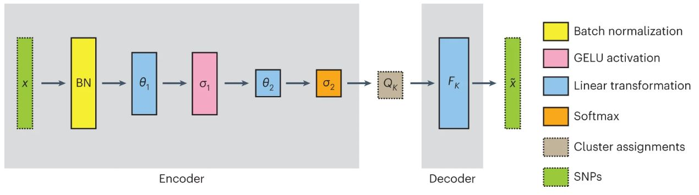

[](https://github.com/AI-sandbox/neural-admixture/actions)

[](https://zenodo.org/badge/latestdoi/331290967)

# Neural ADMIXTURE

Neural ADMIXTURE is an unsupervised global ancestry inference technique based on ADMIXTURE. By using neural networks, Neural ADMIXTURE offers high quality ancestry assignments with a running time which is much faster than ADMIXTURE's. For more information, we recommend reading [our corresponding article](https://www.nature.com/articles/s43588-023-00482-7).

The software can be invoked via CLI and has a similar interface to ADMIXTURE (_e.g._ the output format is completely interchangeable). While the software runs in both CPU and GPU, we recommend using GPUs if available to take advantage of the neural network-based implementation.



## System requirements

### Hardware requirements
The successful usage of this package requires a computer with enough RAM to be able to handle the large datasets the network has been designed to work with. Due to this, we recommend using compute clusters whenever available to avoid memory issues.

### Software requirements

The package has been tested on both Linux (CentOS 7.9.2009, Ubuntu 18.04.5 LTS) and MacOS (BigSur 11.2.3, Intel and Monterey 12.3.1, M1). It is highly recommended to use GPUs for optimal performance - make sure CUDA drivers are properly installed.

We recommend creating a fresh Python 3.9 environment using `conda` (or `virtualenv`), and then install the package `neural-admixture` there. As an example, for `conda`, one should launch the following commands:

```console
$ conda create -n nadmenv python=3.9
$ conda activate nadmenv
(nadmenv) $ pip install neural-admixture
```

If you want to use GPUs, also install:

```console
$ conda install cuda-nvcc -c nvidia
```

And make sure these environment variables are set in your shell before running your code:

```console
$ export CUDA_HOME=$CONDA_PREFIX/pkgs/cuda-toolkit
$ export NCCL_HOME=$CONDA_PREFIX
$ export LD_LIBRARY_PATH=$CONDA_PREFIX/lib
```

**Important note:** Using GPUs greatly speeds up processing and is recommended for large datasets.

Specify the number of GPUs (`--num_gpus`) and CPUs (`--num_cpus`) you have available in your machine to optimize the performance.

## Installation Guide

The package can be easily installed in at most a few minutes using `pip` (make sure to add the `--upgrade` flag if updating the version):

```console
(nadmenv) $ pip install neural-admixture
```

## Usage 
### Running Neural ADMIXTURE

To train a model from scratch, simply invoke the following commands from the root directory of the project. For more info about all the arguments, please run `neural-admixture train --help`. If training a single-head version of the network suffices, please use the flag `--k` instead of `--min_k` and `--max_k`. Note that BED, PGEN and VCF are supported as of now. 

For unsupervised Neural ADMIXTURE (single-head):

```console
$ neural-admixture train --k K --name RUN_NAME --data_path DATA_PATH --save_dir SAVE_PATH
````

For unsupervised Neural ADMIXTURE (multi-head):

```console
$ neural-admixture train --min_k K_MIN --max_k K_MAX --name RUN_NAME --data_path DATA_PATH --save_dir SAVE_PATH
````

For supervised Neural ADMIXTURE:

```console
$ neural-admixture train --k K --supervised --populations_path POPS_PATH --name RUN_NAME --data_path DATA_PATH --save_dir SAVE_PATH # only single-head support at the moment
```

As an example, the following ADMIXTURE call

```console
$ ./admixture snps_data.bed 8 -s 42
```

would be mimicked in Neural ADMIXTURE by running

```console
$ neural-admixture train --k 8 --data_path snps_data.bed --save_dir SAVE_PATH --init_file INIT_FILE --name snps_data --seed 42
```

with some parameters such as the decoder initialization or the save directories not having a direct equivalent.

Several files will be output to the `SAVE_PATH` directory (the `name` parameter will be used to create the whole filenames):
- If the unsupervised version is run, a `Pickle` binary file containing the PCA object (using the `init_name` parameter), as well as an image file containing a PCA plot.
- A `.P` file, similar to ADMIXTURE.
- A `.Q` file, similar to ADMIXTURE.
- A `.pt` file, containing the weights of the trained network.
- A `_pca.pt` file, containing the PCA weights of the trained network.
- A `.json` file, with the configuration of the network.

The last three files are required to run posterior inference using the network, so be aware of not deleting them accidentally! Logs are printed to the `stdout` channel by default. If you want to save them to a file, you can use the command `tee` along with a pipe:

```console
$ neural-admixture train --k 8 ... | tee run.log
```

### Inference mode (projective analysis)

ADMIXTURE allows reusing computations in the _projective analysis_ mode, in which the `P` (`F`, frequencies) matrix is fixed to an already known result and only the assignments are computed. Due to the nature of our algorithm, assignments can be computed for unseen data by simply feeding the data through the encoder. This mode can be run by typing `infer` instead of `train` right after the `neural-admixture` call.

For example, assuming we have a trained Neural ADMIXTURE (named `nadm_test`) in the path `./outputs`, one could run inference on unseen data (`./data/unseen_data.bed`) via the following command:

```console
$ neural-admixture infer --name nadm_test --save_dir ./outputs --out_name unseen_nadm_test --data_path ./data/unseen_data.bed
```

For this command to work, files `./outputs/nadm_test.pt` and `./outputs/nadm_test_config.json`, which are training outputs, must exist. In this case, only a `.Q` will be created, which will contain the assignments for this data (the parameter of the flag `out_name` will be used to generate the output file name). This file will be written in the `--save_dir` directory (in this case, `./outputs`).

### Supervised Neural ADMIXTURE

The supervised version of the algorithm can be used when all samples have a corresponding population label. This can be very benificial, especially when dealing with large imbalances in the data (_e.g_ data contains 1K samples from Pop1 and 50 samples from Pop2).

In order to use the supervised mode, the `--pops_path` argument pointing to the file where the ancestries are defined must be passed. The latter file must be a single-column, headerless, plain text file where row `i` denotes the ancestry for the `i`-th sample in the data. We currently do not support datasets which contain samples with missing ancestries.

The supervised mode works by adding a scaled classification loss to the bottleneck of the algorithm (Equation 5 of the paper). The scaling factor can have a big impact on the performance. If it is too small, then the supervised loss will have little impact on the training, so results would be similar to an unsupervised run. On the other hand, if it is too large, then the supervision will dominate training, making the network overconfident in its predictions: essentially, one would get only binary assignments. The default value of the scaling factor is _η=0.05_, and can be controlled using the parameter `--supervised_loss_weight`.

Basically, if on validation data you are getting single-ancestry estimations when you expect admixed estimations, try setting a smaller value for the supervised loss scaling factor _η_ (`--supervised_loss_weight`).

Moreover, note that the initialization method chosen will have no effect, as the supervised method is always used when using the supervised version.

## Other options
- `batch_size`: number of samples used at every update. If you have memory issues, try setting a lower batch size. Defaults to 800.
- `n_components`: dimension of the PCA projection for SVD. Defaults to 8.
- `epochs`: maximum number of times the whole training dataset is used to update the weights. Defaults to 250. 
- `learning_rate`: dictates how large an update to the weights will be. If you find the loss function oscillating, try setting a lower value. If convergence is slow, try setting a higher value. Defaults to 25e-4.
- `seed`: RNG seed for replication purposes. Defaults to 42.
- `num_gpus`: number of GPUs to use during training. Set to 0 for CPU-only execution. Defaults to 0.

## Experiments replication

The datasets _All-Chms_, _Chm-22_ and _Chm-22-Sim_ used in the Experiments section of the article can be found in [figshare](https://doi.org/10.6084/m9.figshare.19387538.v1). For descriptions of the datasets, please refer to the corresponding section in the paper. The exact hyperparameters used in the experiments to allow replication can be found in the Supplementary Table 3 of the article.

## Demo

To run the software with a small demo dataset, check the instructions in [the corresponding folder of the repository](https://github.com/AI-sandbox/neural-admixture/tree/main/demo).

## License

**NOTICE**: This software is available for use free of charge for academic research use only. Academic users may fork this repository and modify and improve to suit their research needs, but also inherit these terms and must include a licensing notice to that effect. Commercial users, for profit companies or consultants, and non-profit institutions not qualifying as "academic research" should contact the authors for a separate license. This applies to this repository directly and any other repository that includes source, executables, or git commands that pull/clone this repository as part of its function. Such repositories, whether ours or others, must include this notice.

## Cite

When using this software, please cite the following paper:

```{tex}
@article{dominguezmantes23,
	abstract = {Characterizing the genetic structure of large cohorts has become increasingly important as genetic studies extend to massive, increasingly diverse biobanks. Popular methods decompose individual genomes into fractional cluster assignments with each cluster representing a vector of DNA variant frequencies. However, with rapidly increasing biobank sizes, these methods have become computationally intractable. Here we present Neural ADMIXTURE, a neural network autoencoder that follows the same modeling assumptions as the current standard algorithm, ADMIXTURE, while reducing the compute time by orders of magnitude surpassing even the fastest alternatives. One month of continuous compute using ADMIXTURE can be reduced to just hours with Neural ADMIXTURE. A multi-head approach allows Neural ADMIXTURE to offer even further acceleration by computing multiple cluster numbers in a single run. Furthermore, the models can be stored, allowing cluster assignment to be performed on new data in linear time without needing to share the training samples.},
	author = {Dominguez Mantes, Albert and Mas Montserrat, Daniel and Bustamante, Carlos D. and Gir{\'o}-i-Nieto, Xavier and Ioannidis, Alexander G.},
	doi = {10.1038/s43588-023-00482-7},
	id = {Dominguez Mantes2023},
	isbn = {2662-8457},
	journal = {Nature Computational Science},
	title = {Neural ADMIXTURE for rapid genomic clustering},
	url = {https://doi.org/10.1038/s43588-023-00482-7},
	year = {2023},
	bdsk-url-1 = {https://doi.org/10.1038/s43588-023-00482-7}}

```
